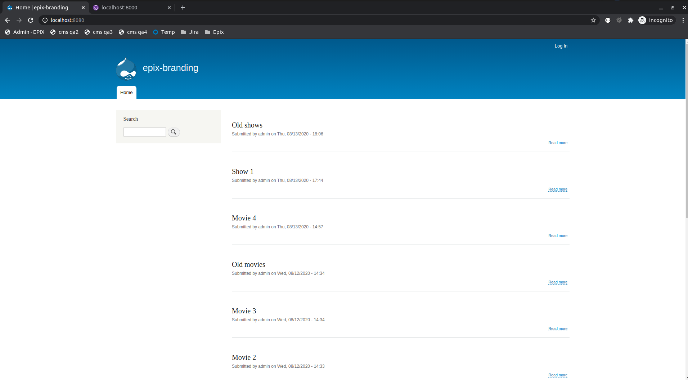

## Frontend drupal spike
All the docs needed to run a [drupal instance](https://www.drupal.org/) that 
have to be used by the [frontend application](https://github.com/RaduBuciuceanu/spike.drupal.frontend). 



## Requirements
* Docker
* Docker compose
* Network connection

Before you start, take sure to use a GNU compatible terminal. Otherwise 
you will get some errors.

--- 

Also, before you start, take sure you have right permissions for 
the `volumes` folder by running the following command:

```
sudo chown -R 777 volumes/drupal-mysql
```

---

## Setup
Run the following commands inside your terminal:
```
docker-compose build
docker-compose up
```

Done, your dashboard should be accessible through the following
url: 
* http://localhost:8080

## Teardown
Run the following command inside your terminal:
```
docker-compose down
```

## Credentials
Here you can find all the necessary credentials.

|Key|Value|
|---|---|
|Drupal username|`admin`|
|Drupal password|`admin`|
|Database username|`user`|
|Database password|`password`|
|Database root password|`password`|
